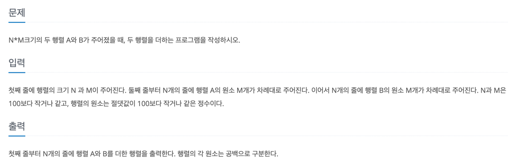

# 풀이

## 필요한 개념 : Scanner
- 입력값 받는 객체

        Scanner scan = new Scanner(System.in);

- 입맛대로 배열 선언

        line = scan.nextInt();
        column = scan.nextInt();

        int [][] array1 =  new int[line][column];
